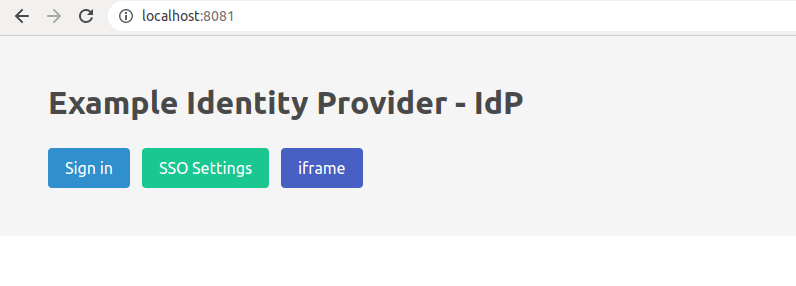
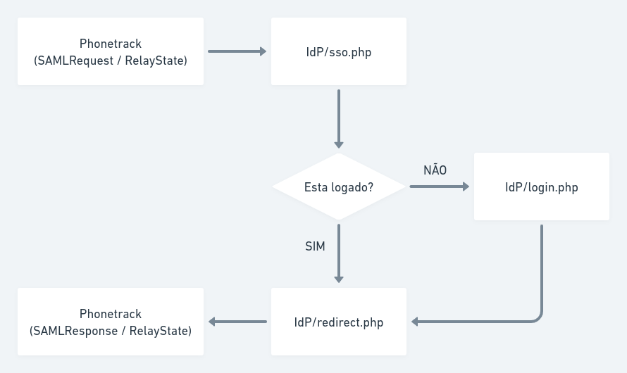
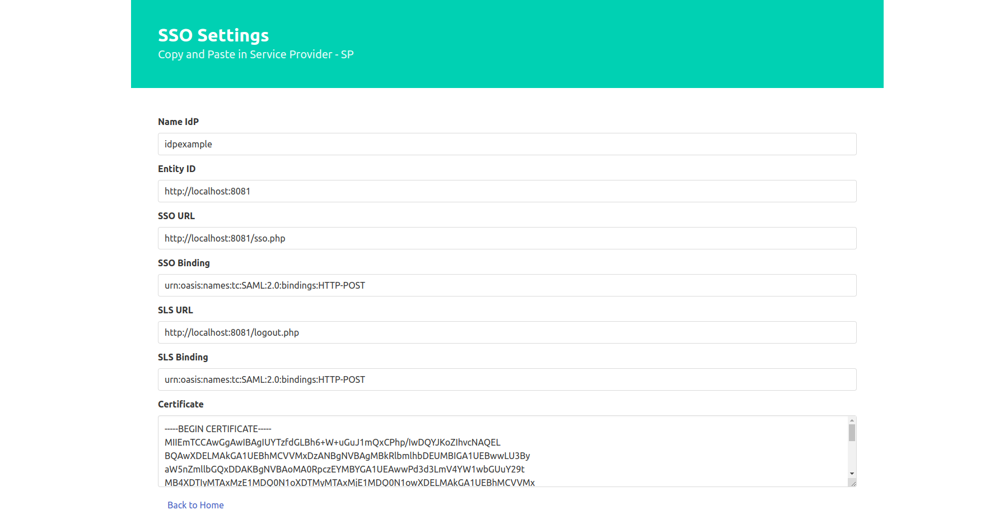

# Identity Provider - IdP


### Iniciando projeto

```
docker-compose up -d --build
```

## Acessando projeto localhost

[http://localhost:8081/](http://localhost:8081/)



## Configuração Phonetrack

```php
<?php
#./config.php
return [
    'phonetrack' => [
        'host' => 'https://phonetrack.app',
        'account_id' => 1, // Informe aqui a Conta que o usuario tem acesso
        'units_id' => '2' // Informe aqui as Unidades que o usuario tem acesso: 1,2,3,4,5
    ],
    'idp' => [
        'name' => 'idpexample' // Nome do Provedor de identidade: NameIdP
    ]
];
```

### Rotas disponiveis

- / - Home
- /info.php - Settings
- /login.php - Sign in
- logout.php - Sign out
- /sso.php - SSO with SAML
- /redirect.php - Redirect SAML Response


### Criando certificado x509

```
openssl req -newkey rsa:3072 -new -x509 -days 3652 -nodes -out certificate.crt -keyout private_key.pem
```

### Variavel de ambiente com caminho para `private key` e `certificate`

```
PRIVATE_KEY_PATH=/path/to/my/private_key.pem
CERTIFICATE_PATH=/path/to/my/certificate.crt
```

### Login SAML



## O que eu preciso entender desse fluxo?

**SSO**

O arquivo [sso.php](public/sso.php) é responsavel por receber o `SAMLRequest` criptografado e `RelayState` criado a partir do Provedor de Serviço.

O [sso.php](public/sso.php) faz a descriptografia do `SAMLRequest` e extrai os metadados.

| Metadado | Descrição |
|----------|-----------|
|ID| Identificador da requisição SAML|
|[AssertionConsumerServiceURL](https://medium.com/tech-learn-share/assertion-consumer-service-url-and-entity-id-issuer-in-saml-a18e7062e459) | Esse campo contém o URL que será utilizado para enviar o `POST` com `SAMLResponse` e `RelayState`.|
|IssueInstant | Contém a data e hora de inicio da requisição SAML. Essa data  é importante porque é utilizada para validar se a requesição está expirada. Ex.: `2022-10-10T12:33:28Z`|

**Redirect**

O arquivo [redirect.php](public/redirect.php) é responsavel por formatar e criptografar o `SAMLResponse`.

**Formatando um SAMLResponse**

O SAMLResponse é composto de algumas informações importante para garantir a confiabilidade dos dados enviado para o Provedor de Serviço.

| Metadado | Descrição |
|----------|-----------|
|IssueInstant | Contém a data e hora de inicio da requisição SAML. Essa data  é importante porque é utilizada para validar se a requesição está expirada. Ex.: `2022-10-10T12:33:28Z`|
|InResponseTo| Uma referência ao identificador da solicitação. Deve corresponder ao valor do atributo ID do `SAMLRequest` correspondente.|
|Issuer| Identifica a entidade que gerou a mensagem de resposta|
|Signature| Contém uma assinatura digital que garante a autenticidade e integridade dos metadados.|
|Status|Um código que representa o status da solicitação correspondente|
|Assertion|O elemento `Assertion` é um tipo complexo. Este tipo especifica informações que são comuns a todas as asserções, incluindo os seguintes elementos e atributos|

| Assertion Metadado | Descrição |
|----------|-----------|
|Issuer|Identifica a entidade que gerou a mensagem de resposta|
|Subject|Identifica o principal autenticado. O `nameID` com o nome do usuario autenticado.<br/>`<saml:NameID Format="urn:oasis:names:tc:SAML:1.1:nameid-format:emailAddress">Teste 01</saml:NameID>`|
|Conditions|As condições sob as quais a afirmação deve ser considerada válida|
|AuthnStatement|Descreve a forma de autenticação no provedor de identidade|
|AttributeStatement|Atributos associado ao usuario autenticado.<br/>A Phonetrack depende do `email`, `account_id` e `units_id`|

**Exemplo de XML SAMLResponse**

```xml
<?xml version="1.0"?>
<samlp:Response xmlns:saml="urn:oasis:names:tc:SAML:2.0:assertion" xmlns:samlp="urn:oasis:names:tc:SAML:2.0:protocol" Version="2.0" ID="pfxb1e42802-f516-1c47-427a-aefb30d24db8" IssueInstant="2022-10-10T12:33:28Z" InResponseTo="ONELOGIN_aa3753b2987ae987f9cd62814f052586826a4c22">
    <saml:Issuer>http://localhost:8081</saml:Issuer>
    <ds:Signature xmlns:ds="http://www.w3.org/2000/09/xmldsig#">
        <ds:SignedInfo>
            <ds:CanonicalizationMethod Algorithm="http://www.w3.org/2001/10/xml-exc-c14n#" />
            <ds:SignatureMethod Algorithm="http://www.w3.org/2001/04/xmldsig-more#rsa-sha256" />
            <ds:Reference URI="#pfxb1e42802-f516-1c47-427a-aefb30d24db8">
                <ds:Transforms>
                    <ds:Transform Algorithm="http://www.w3.org/2000/09/xmldsig#enveloped-signature" />
                    <ds:Transform Algorithm="http://www.w3.org/2001/10/xml-exc-c14n#" />
                </ds:Transforms>
                <ds:DigestMethod Algorithm="http://www.w3.org/2001/04/xmlenc#sha256" />
                <ds:DigestValue>OMG8i4tYRYmHpCRy3e1SevzUQKYi48YTneIUyO7TA2w=</ds:DigestValue>
            </ds:Reference>
        </ds:SignedInfo>
        <ds:SignatureValue>qqGrvo96nlkDQXtOxsL554ycZVkwAVVMIxXicnHiCAHV</ds:SignatureValue>
        <ds:KeyInfo>
            <ds:X509Data>
                <ds:X509Certificate>MIIEmTCCAwGgAwIBAgIULJp5Dqvulmk</ds:X509Certificate>
            </ds:X509Data>
        </ds:KeyInfo>
    </ds:Signature>
    <samlp:Status>
        <samlp:StatusCode Value="urn:oasis:names:tc:SAML:2.0:status:Success" />
    </samlp:Status>
    <saml:Assertion xmlns:saml="urn:oasis:names:tc:SAML:2.0:assertion" xmlns:xs="http://www.w3.org/2001/XMLSchema" xmlns:xsi="http://www.w3.org/2001/XMLSchema-instance" Version="2.0" ID="_be97c5c4-4897-11ed-b9cf-0242c0a8b002" IssueInstant="2022-10-10T12:33:28Z">
        <saml:Issuer>http://localhost:8081</saml:Issuer>
        <saml:Subject>
            <saml:NameID Format="urn:oasis:names:tc:SAML:1.1:nameid-format:emailAddress">Teste 01</saml:NameID>
            <saml:SubjectConfirmation Method="urn:oasis:names:tc:SAML:2.0:cm:bearer">
                <saml:SubjectConfirmationData NotOnOrAfter="2022-10-10T12:36:28Z" Recipient="" InResponseTo="ONELOGIN_aa3753b2987ae987f9cd62814f052586826a4c22" />
            </saml:SubjectConfirmation>
        </saml:Subject>
        <saml:Conditions NotBefore="2022-10-10T12:30:28Z" NotOnOrAfter="2022-10-10T12:36:28Z">
            <saml:AudienceRestriction>
                <saml:Audience />
            </saml:AudienceRestriction>
        </saml:Conditions>
        <saml:AuthnStatement AuthnInstant="2022-10-10T12:33:28Z" SessionNotOnOrAfter="2022-10-11T12:33:28Z" SessionIndex="85f33aa7b040798b7c6849e97dca3605">
            <saml:AuthnContext>
                <saml:AuthnContextClassRef>urn:oasis:names:tc:SAML:2.0:ac:classes:PasswordProtectedTransport</saml:AuthnContextClassRef>
            </saml:AuthnContext>
        </saml:AuthnStatement>
        <saml:AttributeStatement>
            <saml:Attribute NameFormat="urn:oasis:names:tc:SAML:2.0:attrname-format:basic" Name="units_id">
                <saml:AttributeValue xmlns:xsi="http://www.w3.org/2001/XMLSchema-instance" xsi:type="xs:string">2</saml:AttributeValue>
            </saml:Attribute>
            <saml:Attribute NameFormat="urn:oasis:names:tc:SAML:2.0:attrname-format:basic" Name="email">
                <saml:AttributeValue xmlns:xsi="http://www.w3.org/2001/XMLSchema-instance" xsi:type="xs:string">teste01@example.com</saml:AttributeValue>
            </saml:Attribute>
            <saml:Attribute NameFormat="urn:oasis:names:tc:SAML:2.0:attrname-format:basic" Name="account_id">
                <saml:AttributeValue xmlns:xsi="http://www.w3.org/2001/XMLSchema-instance" xsi:type="xs:string">1</saml:AttributeValue>
            </saml:Attribute>
        </saml:AttributeStatement>
    </saml:Assertion>
</samlp:Response>
```
**Exemplo de SAMLResponse criptografado**

```php
$xml_saml_response = "AQUI VAI O XML";
$saml_response = base64_encode($xml_saml_response);
```

**Formulario de resposta**

É enviar um formulario `POST` contendo `SAMLResponse` criptografado e `RelayState` com o URL de redirecionamento no Provedor de Serviço.

```html
<form method="post" action="http://sp.example.com/path/to/saml/acs/login">
        <input name="SAMLResponse" type="hidden" value='OMG8i4tYRYmHpCRy3e1SevzUQKYi48Y'>
        <input name="RelayState" type="hidden" value="/path/to/redirect">
</form>
```
*Exemplo Backend [public/redirect.php](/public/redirect.php)*
*Exemplo Frontend [src/View/redirect.phtml](/src/View/redirect.phtml)*

**URL de redirecionamento**

O `RelayState` contém o URL que o Provedor de Serviço - SP utiliza para redirecionar após receber a resposta do Provedor de Identidade - IdP.

Esse `RelayState` é enviado pelo SP para o IdP e quando o IdP enviar a resposta para o SP esse `RelayState` deve ser enviado tambem.

Você pode ver a presença do `RelayState` na imagem de fluxo logo a encima.


## Configuração para integração do IdP

Essas são as informações para integrar com o Provedor de identidade.

Acesse [http://localhost:8081/info.php](http://localhost:8081/info.php)

